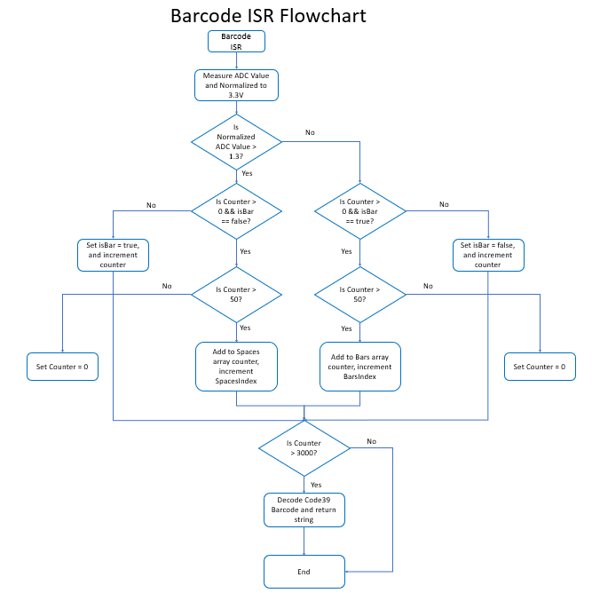

# CSC2003 Team A2 Infrared Module
## Table of Centents
* Video Demo
* Wheel Encoder
* Barcode Reader

## Video Demo
[Video Demo](https://youtu.be/8ZiBQdfVQCY)

## Wheel Encoder
Our wheel encoder is able to output the Current Speed (M/s) and the Total Distance traveled. 
The left and right counter is derived via a interrupt when the sensor detects a notch has passed and increment the counter accordingly. 
The Current Speed and Total Distance Traveled is derived from a 1 second timer that checks the left and right counter and using the notch length and average of left and right counter.

The current speed is calculated from the average current distance traveled of the two wheel, using the formula "curSpeed = (((leftCounter + rightCounter) / 2) * NOTCHLENGTH) / CMtoM" to get the current speed in meter/s.
Where NOTCHLENGTH is 1.02cm rounded up, CMtoM is 100 to convert the speed from cm to meter.
The total distance is an aggregate of from the Current Speed every 1 second.

Using this method will allow us to calculate the speed and distance the wheel traveled without the need for extra calculations using other forumlas which increases the load on the MSP.

### Potential Improvements
Using a wheel encoder with an ADC output instead of Digital output will help increase the accuracy of the data by reading the ADC's wave output allowing detection of half/quarter rotations.

The general flow of the functions and a comparison of the measured distance measured can be found below:

### Wheel Encoder ISR and Timer Flowchart

### Comparison betweeen Actual Distance and Measured Distance

## Barcode Reader
Our barcode reader is able to read the 3 different lengths of barcode: Big, Mediam, Small.

The ADC value used to determine wether the detected color is white or black is the normalizedADCRes variable, it uses the direct data input from the infrared sensor and converts it into a normalized value allowing easier managment.

By using a counter variable to count the amount of ticks the sensor is on either white or black and by moving the sensor/car at a constant speed we are able to use this counter to determine the thickness of the bars and spaces. By increasing the DCOCenteredFrequency to 48Mhz we are able to improve the accuracy of the sensor by increasing the scanning speed of it.

By implementing filters like removing false postives eg. any counters that are below 10 as well as removing any counters that are above 500 helps improve the accuracy of the results, however by setting 500 as the highest amount the counter can go means that the sensor/car has to make quite fast between white and black.

To determine the width of the white and black parts, we used the highest and lowest counted value of each color and divide it by to as well as subtracing it bby the lowest counter divided by 3 ((highest + lowest)/2 - lowest/3) this gives us an average value which allows us to determine the width of the color. Know that there are 5 blacks (bars) and 4 whites (spaces) in one character of code39 allows us to decode the characters one by one.

To decode the characters we convert the width of the black and white parts of the barcode into binary 1 being wide and 0 being thin and combining the 9 binary values together, putting the 5 blacks infront and 4 whites behind eg. "011000010" allows us to finally decode the code39, using a if-else function that consist of most of the characters in code39 it allows us to covert the string of binary numbers to a character eg. "F" and return it. By decoding every 9 binary value and skipping the next value, we are able to decode any length of code39 as long as it is within the array size.

The general flow of the functions and comparisons of the sensor accuracy can be found below:

### Barcode ISR Flowchart

### Comparison betweeen Barcode Length and Measured Barcode Accuracy

