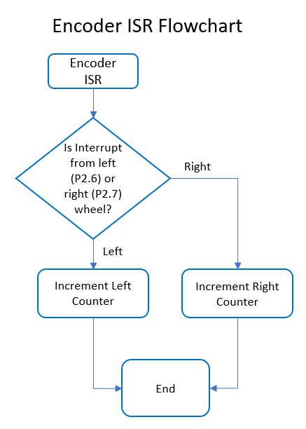
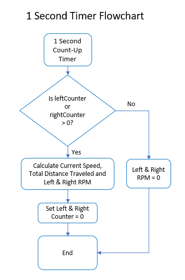
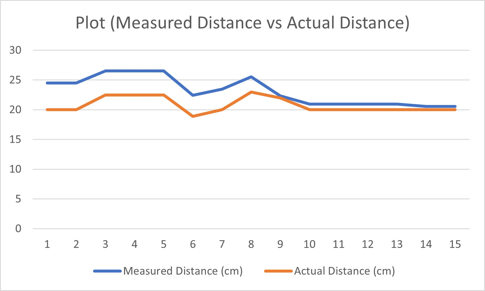
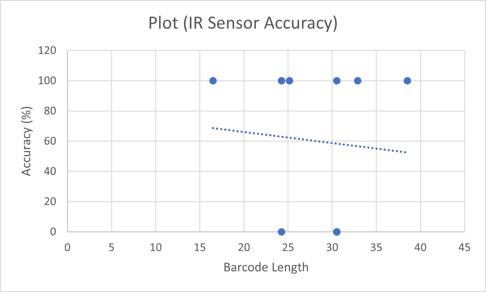

# CSC2003 Team A2 Infrared Module
## Table of Centents
* Wheel Encoder
* Barcode Reader

## Wheel Encoder
Our wheel encoder is able to output the left and right wheel RPM, the Current Speed (M/s) and the Total Distance traveled. 
The left and right RPM is derived from the left and right counter which is incremented via a interrupt when the sensor detects a notch has passed. 
The Current Speed and Total Distance Traveled is derived from a 1 second timer that checks the left and right counter and using the notch length and average of left and right counter.

The formula used to calculate the left and right RPM is "RPM = (FREQ x TIMEVAL) / TOTALNOTCHES", which is used alongside a 1 second timer to calculate the RPM every second.
Where FREQ is the left or right counter, TIMEVAL is 60 to get 1 minute based on the 1 sec timer, TOTALNOTCHES is 20.

The current speed is calculated from the average current distance traveled of the two wheel, using the formula "curSpeed = (((leftCounter + rightCounter) / 2) * NOTCHLENGTH) / CMtoM" to get the current speed in meter/s.
Where NOTCHLENGTH is 1.02cm rounded up, CMtoM is 100 to convert the speed from cm to meter.
The total distance is an aggregate of from the Current Speed every 1 second.

Using this method will allow us to calculate the speed and distance the wheel traveled without the need for extra calculations using other forumlas which increases the load on the MSP.

The general flow of the functions can be found below:

### Wheel Encoder ISR and Timer Flowchart

### Comparison betweeen Actual Distance and Measured Distance

## Barcode Reader
Our barcode reader is able to read the 3 different lengths of barcode: Big, Mediam, Small.

Comparison betweeen Barcode Length and Measured Barcode Accuracy
