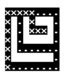
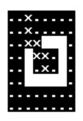
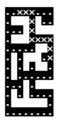
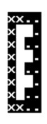
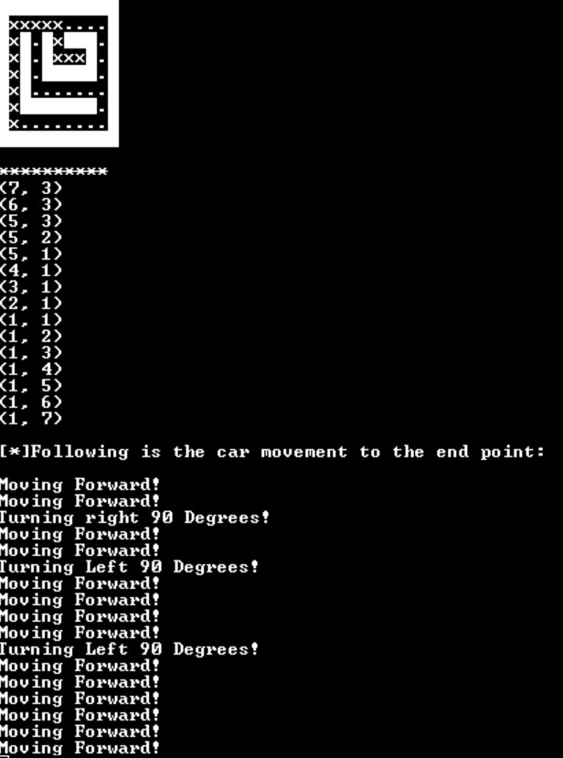

# Mapping & Navigation
The mapping and navigation was done using Raspberry PICO. The demonstration video will illustrate how PICO was used and the ouputs on the displayed on console. 

## Demonstration Video

### Part 1:

https://user-images.githubusercontent.com/97492848/204567292-2a334069-ecc6-40e3-aa0e-a504c60b00fd.mp4

### Part 2:

## Flow Charts

## Movement

## Shortest Path Algorithm

## Memory Usage on PICO

## Testing
Our group had tested that the mapping and navigation algorithm vigorously to ensure that the algorithm is working.

For black box testing, the algo was tested on its maze generation, the maze generation is done by making the 
The result of blackbox for 5 different mazes can be seen from the demo video as well as the results of the test case are shown as follows:

Maze 1                     |  Maze 2                   | Maze 3                    |  Maze 4                   |  Maze 5
:-------------------------:|:-------------------------:|:-------------------------:|:-------------------------:|:-------------------------:
   |   |    |   |   

For whitebox testing, the algo was tested on its shortest path generation using the A* algorithm.

The image below shows an example console output during our whitebox testing:
The maze shows the coordiantes that it takes into account when moving. In addition, it shows the movement of the car as moving forward and turning left 90 degrees.

Maze 1                     |  
:-------------------------:
 |
