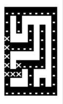

# Mapping & Navigation
The mapping and navigation was done using Raspberry PICO. The demonstration video will illustrate how PICO was used and the ouputs on the displayed on console. 

## Demonstration Video

### Part 1:

https://user-images.githubusercontent.com/97492848/204567292-2a334069-ecc6-40e3-aa0e-a504c60b00fd.mp4

### Part 2:
https://youtu.be/SDc_WiPf1T8

## Flow Charts

## Movement

## Shortest Path Algorithm
The A* Search Algorithm selects the node at each stage based on a value, "f," which is a parameter equal to the sum of two additional factors, "g" and "h." It chooses the node or cell with the lowest "f" at each step and processes that node or cell. We define 'g' and 'h' below as simply as possible: g = the movement cost to move along the created path from the starting point to a particular square on the grid. h is the calculated cost of moving from a specific grid square to the desired location. This is frequently referred to as the heuristic, which is just another word for an educated guess. Because a variety of obstructions (such as walls) may be in the way, we actually can't know the distance until we find the path.

## Memory Usage on PICO

## Testing
Our group had tested that the mapping and navigation algorithm vigorously to ensure that the algorithm is working.

For black box testing, the algo was tested on its maze generation, the maze generation is done by making the 
The result of blackbox for 5 different mazes can be seen from the demo video as well as the results of the test case are shown as follows:

Maze 1                     |  Maze 2                   | Maze 3                    |  Maze 4                   |  Maze 5
:-------------------------:|:-------------------------:|:-------------------------:|:-------------------------:|:-------------------------:
   |   |    |   |   

For whitebox testing, the algo was tested on its shortest path generation using the A* algorithm.

The image below shows an example console output during our whitebox testing:
The maze shows the coordiantes that it takes into account when moving. In addition, it shows the movement of the car as moving forward and turning left 90 degrees.

Maze 1                     |  
:-------------------------:
 |
