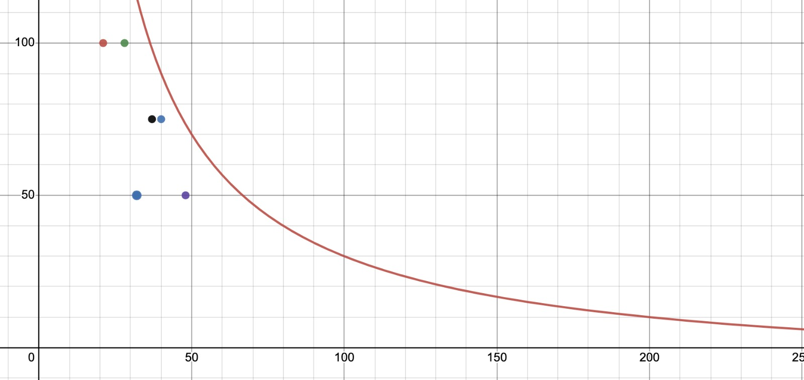
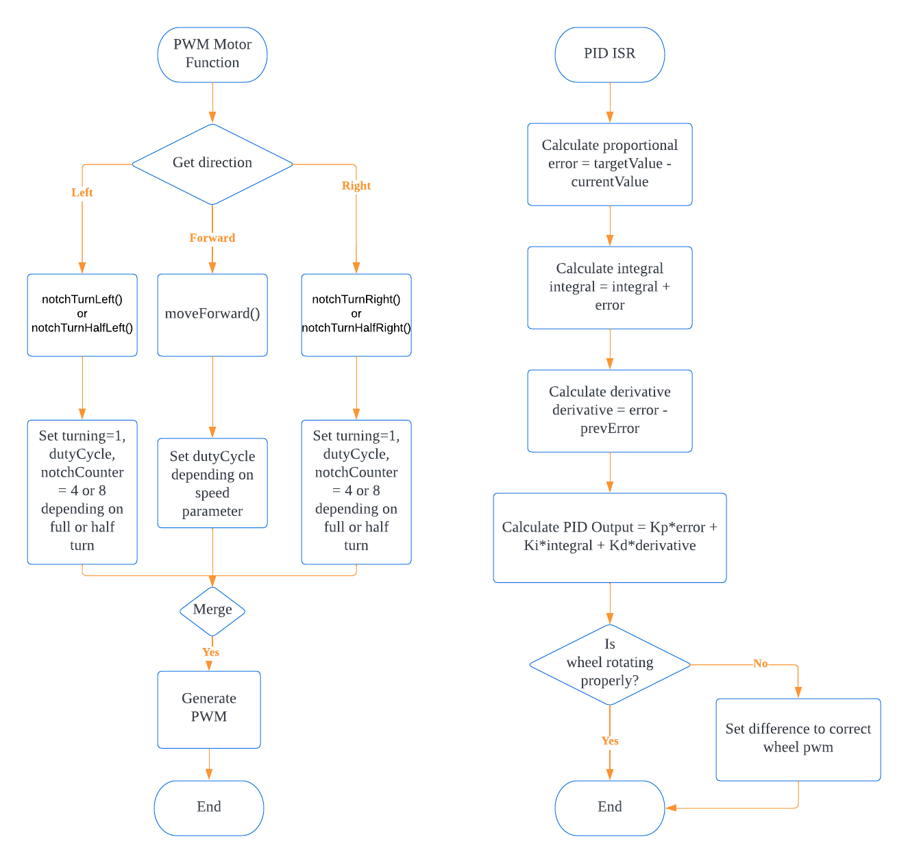
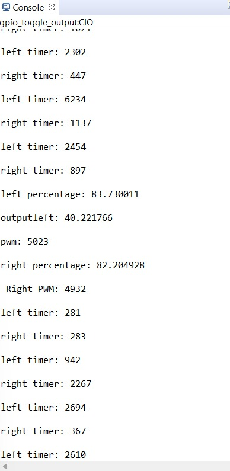

# PWM-PID Module

## Demonstration Video
https://user-images.githubusercontent.com/37941268/204538262-18135b31-3101-4888-8ef7-b1446c8ec3c6.mp4

## Demo Day Slides


## PWM

The PWM module uses timer A SMCLK with a divider of 10 to generate the duty cycle required to adjust the speed of the DC motors. The default speed is 75% duty cycle at 4500. There are two more speed configuration at 50% duty cycle at 3000 and 80% duty cycle at 4800. In order to check the correct amount of distance travelled, the input distance(cm) will be converted into wheel rotations based on the circumference, which is then converted into notches for wheel encoder to detect. The wheel diameter was measured with a ruler to be 6.7cm, which was not very consistent with the stated 6.5cm online. Therefore we calculated the circumference of the wheel to be 21.36 After the set amount of notches, the vehicle will stop. For the turning, testing was done to find the most accurate amount of notches required to rotate 90 and 45 degrees, which was 8 and 4 respectively. Therefore when the msp is in turning mode, it will move by the correct amount of notches before stopping.

## PID
PID controller stands for proportional ($p$), integral ($i$) and derivative ($d$) controller. 
It calculates previous error against a target set point and derives the optimal pulse width to output. 

The team will be collecting the number of ticks that passed using the timer per interval between notches.

$$ t = tick / interval\ between\ notch $$

The main purpose of the PID is to minimise the error value and to provide a basis of values to corrct the deviation with. 
The Error can be calculated with the formula below:

$$Error = t_{optimal} - t_{current}$$

Then, we calculate the the the $p$:
$$p = P * Error$$
$$where\ P = empirical\ constant\ value$$

The integral, is the accumulation of error $i$: 
$$i = I * \sum{Error}$$
$$Where\ I = empirical\ constant\ value$$

The $i$ will be used to modulate the fluctuation of the correction so that there is not a constant oscillation of error.

Lastly, there is the derivative $d$:
$$d= Error_{current} - Error_{last}$$
$$where\ D = empirical\ constant\ value$$

The value of $d$ will signify how fast we want the error to be corrected.

The visual will provide a clearer idea of how PID works


Finally, the last step is to combine the $p$, $i$, $d$:
$

4t_{correction} = p + i + d$$

Once we have $t_{correction} we need to know how much to increase the PWM, to do that we use a transformation curve to calulate the ```ideal tick to PWM``` that is:

$$\f(t) = frac{4000}{t}-10$$

This can be seen in the curve below:


The $x$ is $\frac{t}{100}$ and $y$ is the PWM percentage. The dots are the value collected at the respective $y$ value for PWM when the car is running.

Using the curve we convert $t$ to ideal PWM then we either adjust the PWM up or down by $f(t_{correction})$. However, since this mapping is idealistic, the tuning will definitely be wrong. 

Therefore, this is tackled by allowing the error to normalise over a short period of time. This mean that the "ideal" of the curve might not actually be the "ideal" PWM, rather it is after something the pwm will settle at the idealistic PWM for that the $t$. 

Then do the same for both motor.


## Flowchart
The flowchart below visualizes the logic flow of how our PWM and PID works



## Testing

Our group had tested the PWM-PID vigorously to ensure that the car moves correctly.

For black box testing, the car was tested on it's movements, the PID adjustments towards the left and right wheels and also the speed of the DC motors. We spent the majority of the time tweaking the pid gains value of the proportional, integral and derivative constants. The result of blackbox can be seen from the demo video shown above previously

For whitebox testing, the number of ticks from one notch to the other notch for both wheels are printed on the serial console to visualize the movements of the wheels. The calculated percentage of the DC motor's output and the intensity of the PWM supplied to the DC motors is also printed on the serial console so that we know how the PID controller is adjusting the duty cycles of the PWM.

The image below shows an example console output during our whitebox testing


