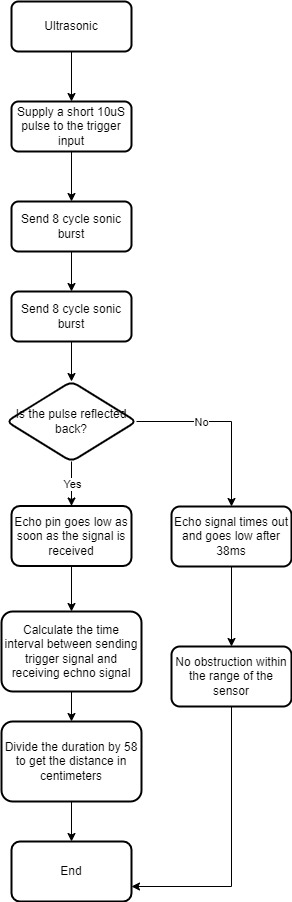

# CSC2003 Team A2 Ultrasonic & Accelerometer

## Demonstration Video
Accelerometer- https://youtu.be/UvcUy4FrEqY
Ultrasonic- https://youtu.be/dLIPSy2azj8

### Ultrasonic

<b>How the ultrasonic work? </b>  
The ultrasonic work by supplying a short 10 microseconds pulse to trigger the input to start the ranging, and then the module will send a short 8 cycle burst of ultrasonic and raises it echo. If the 8 cycle burst are reflected back, the echo pin goes low as soon as the signal is received. This generates a pulse on the echo pin whose width varies from 150 µs to 25 ms depending on the time taken to receive the signal.The calculation of the distance is using the time interval between sending trigger signal and receiving the echo signal. From there, the team decided to use the Formula: <b>uS / 58 = centimeters</b> which will get you the distance.

#### Ultrasonic Flowchart

&nbsp;&nbsp;&nbsp; 

#### Comparison betweeen Actual Distance and Measured Distance

#### Testing

### Accelerometer
