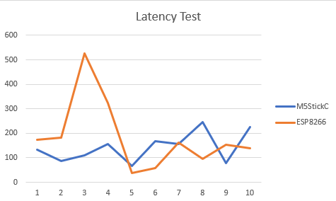

# CSC2003 Team A2 Communications Module
## Table of contents
* [UART Performance](#uart-performance)
* [Wi-Fi M5StickC PLUS](#wi-fi-m5stickc-plus)
* [Wi-Fi ESP8266](#wi-fi-esp8266)
* [IOT protocols](#IOT-protocols)

## UART Performance

|Technology          |Latency          |Throughput |
|--------------------|-----------------|-----------|
|Wi-Fi M5stickC Plus |130.662 ms         |0.40171 MB/s|
|Wi-Fi ESP8266       |201.320 ms       |0.26213 MB/s|

We are able to calculate the throughput using the formula: 

`Throughput = Window Size (bits) / Round-Trip-Time (s)`

Standard TCP Window size is 64KB. 64KB converted to bits is 52488.

## Wi-Fi M5StickC PLUS
### Test Parameters:
Latency Test: 1000 characters sent sequentially

Throughput Test: 1KB message sent

### Result Images:

<ins>Latency Test</ins>

Conducted a latency test 13 times and calculated the average

|Test  |Latency     |
|------|------------|
|1     |131.7187 ms |
|2     |088.0987  ms |
|3     |110.0987 ms |
|4     |156.4066 ms |
|5     |067.1878  ms|
|6     |167.0642 ms |
|7     |156.9209 ms |
|8     |246.2801 ms |
|9     |076.8930  ms |
|10    |224.2873 ms |
|11    |050.2345  ms |
|12    |123.4315 ms |
|13    |099.9821  ms |

<ins>Throughput Test</ins>

## Wi-Fi ESP8266
## Test Parameters:
To check the round-trip-time, we used the ping feature within laptops. It will retrieve the minimum, average, maximum and standard deviation.

Latency Test: 64 bytes sent from Laptop to MSP432

## IOT protocols
Comparison betweeen UDP socket and MQTT

