# CSC2003 Team A2 Communications Module

For the commmunications side of the team, we have tested the different networking protocols and the peripherals. We ran and tested each protocol against each other to see which is the best implementation for our team moving forward.

### Configurations Tested
* MSP432 → M5Stickcplus via UART
* MSP432 → ESP8266 via UART
* MSP432 → M5Stickcplus via I2C *(not working)*
* PICO → M5StickC plus via UART
* UDP, TCP, MQTT, HTTP, Bluetooth 4.0

## Table of contents
* [Technologies](#technologies)
* [IOT protocols](#iot-protocols)
* [Blackbox testing](#blackbox-testing)
* [UART Performance](#uart-performance)
* [Wi-Fi M5StickC Plus](#wi-fi-m5stickc-plus)
* [Wi-Fi ESP8266](#wi-fi-esp8266)
* [Bluetooth](#bluetooth)
* [Bluetooth Serial Terminal](#https://play.google.com/store/apps/details?id=de.kai_morich.serial_bluetooth_terminal&hl=en_SG&gl=US&pli=1)

***
## __Technologies__
All devices and peripherals used in this project was provided from the university. Items used in this project are as follows:
* [MSP432 P401R LaunchPad Development Kit](#https://www.amazon.com/Development-Boards-Kits-MSP432P401R-LaunchPad/dp/B01LWR1MSO)
* [Raspberry Pi Pico](#https://www.raspberrypi.com/products/raspberry-pi-pico/)
* [M5StickC Plus](#https://shop.m5stack.com/products/m5stickc-plus-esp32-pico-mini-iot-development-kit)
    * [ESP32-PICO-D4](#https://www.espressif.com/en/products/socs/esp32)
* [ESP8266 Wi-Fi Module](#https://www.espressif.com/en/products/socs/esp8266)
* [Code Compiler Studio](#https://www.ti.com/tool/CCSTUDIO)
* [Arduino IDE](#https://www.arduino.cc/en/software)
* [UIFlow IDE](#https://flow.m5stack.com)
***

## Configuration

### How to run webpage
No installation required. Open MQTT Web.htm and subscribe to csc2003comms. 

## IOT protocols
### Environment Setup
* All configurations in this section are tested using M5stickcplus
* 4G Hotspot: 127.22Mbps download
* Measured Using stopwatch app on a 120HZ refresh display Ipad Pro
* Captured Using Pixel 6 120FPS slowmotion video capture

 Note: M5stickcplus does not have a CMOS battery like PC/Laptop to maintain time. It has to fetch the time from an NTP server which is not ms accurate, therefore we are unable to measure time using timestamp method. A physical setup was created to measure 1 way latency. High refresh display and capture is used to get latency as accurate as possible. We recorded the time on the stopwatch when the data was sent (the counter will increase on m5stick display), and when the data was received in the PC terminal.

### Lactency for 1 way
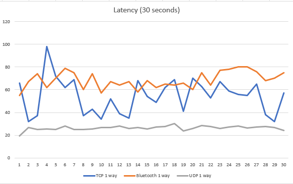

### Latency with MQTT
When we changed the publisher from laptop to M5StickC plus, we noticed there was a big difference is latency. We suspect it is due to the API (M5mqtt) that is causing a significant increase in latency ([M5Stack MQTT Documentation](https://docs.m5stack.com/en/mpy/advanced/mqtt))

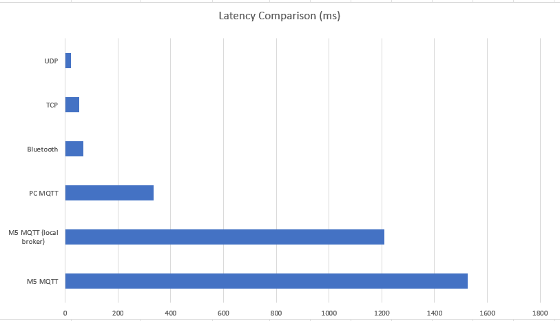

### Lactency for RTT
For RTT, we are able to measure using Python Time library

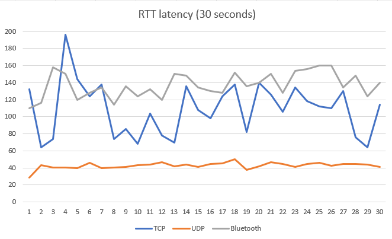

### Blackbox testing
>MSP432 → UART → M5STICK → MQTT → WEBPAGE

Note: Most of the delay is caused by MQTT communication from UART to Webpage
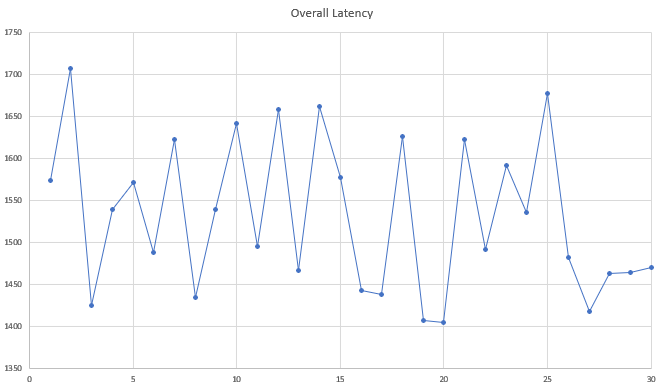

## UART Performance

|Technology          |Latency mean     |Latency standard deviation|Throughput
|--------------------|-----------------|-----------|-|
|Wi-Fi M5stickC Plus |116.407 ms       |193.483 ms|551.724 KB/s|
|Wi-Fi ESP8266       |193.483 ms       |207.000 ms|280.702 KB/s|

We collated thirty samples of the Round-Trip-Time(RTT) and collated the data to identify the differences between the M5StickC Plus & ESP8266 to decide on the final implementation. We are able to use the ping feature on the computer to ping the respective modules to test latency with 64KB of data. We are able to calculate the throughput using the formula: 

`Throughput(bps) = Window Size (bits) / Round-Trip-Time (s)`

|Iterations          |M5stickC Plus (ms)    |ESP8266 (ms) |
|--------------------|-----------------|-----------|
|1	|203	|136.913|
|2	|225	|139.594|
|3	|247	|259.17|
|4	|167	|178.394|
|5	|22.6	|196.298|
|6	|60.2	|118.159|
|7	|86.9	|336.474|
|8	|9.52	|57.057|
|9	|63.4	|91.235|
|10	|84.1	|90.764|
|11	|8.19	|131.64|
|12	|80.1	|330.514|
|13	|1072	|457.9|
|14	|65.6	|199.489|
|15	|88.2	|389.765|
|16	|229	|203.078|
|17	|65	|1066.422|
|18	|169	|63.728|
|19	|8.12	|87.671|
|20	|66.7	|113.712|
|21	|89	|147.436|
|22	|7.61	|54.699|
|23	|59.1	|268.156|
|24	|27.8	|200.253|
|25	|6.87	|134.573|
|26	|59.7	|530.898|
|27	|74.6	|152.003|
|28	|58.8	|110.178|
|29	|78	|82.614|
|30	|10.1|	525.259|

We were also able to implement Bluetooth 4.0 LE through the M5StickC Plus. The theoretical throughput of 39.04 KB/s. After testing, we have decided to use the M5StickC Plus wi-fi configuration for the final integration into the car as it has proven to be more stable and provide a lower latency over the tests.

## Wi-Fi M5StickC PLUS
Below is the demo to show the message is able to be passed from the MSP432 / Pico to the M5StickC Plus through the UART serial communication. Data received will be displayed on the LCD of the M5StickC Plus

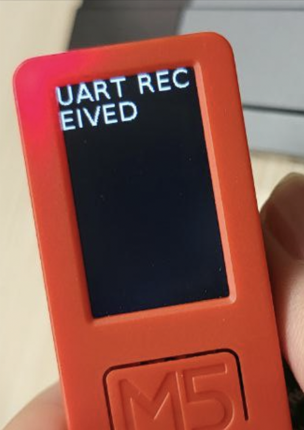
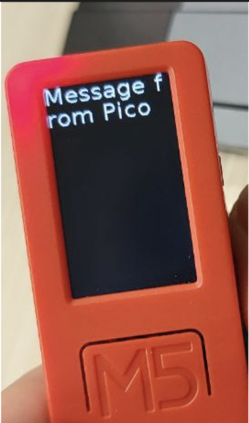

### HTML
We will be using a post test server V2 (PTSV2) to test our POST request over HTTP. We are able to show connectivity through Wi-Fi and pinging the IP address of the M5StickC. Below are the sample: 
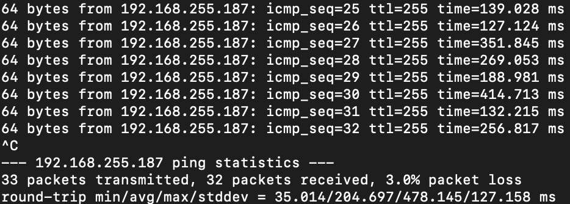
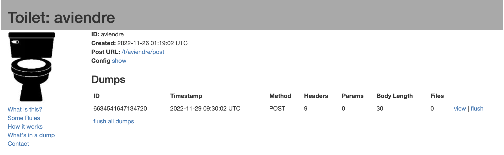
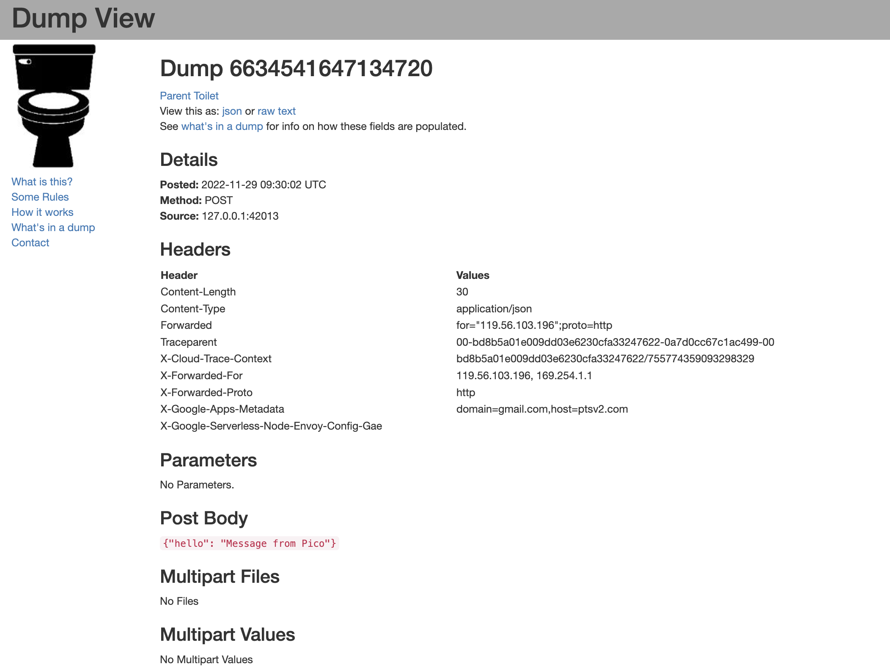

### Test Parameters:
Latency Test: 1000 characters sent sequentially

Throughput Test: 1KB message sent

### Result Images:

<ins>Latency Test</ins>

<ins>Throughput Test</ins>

## Wi-Fi ESP8266
### Test Parameters:
To check the round-trip-time, we used the ping feature within laptops. It will retrieve the minimum, average, maximum and standard deviation.

Latency Test: 64 bytes sent from Laptop to MSP432

## Bluetooth M5StickC Plus
We will also be exploring the bluetooth connectivity with M5StickC Plus. We will have the MSP432 / Pico transfer data through UART and forward that data to a bluetooth terminal. Here is the sample of the M5StickC Plus running the bluetooth terminal using the Arduino IDE:
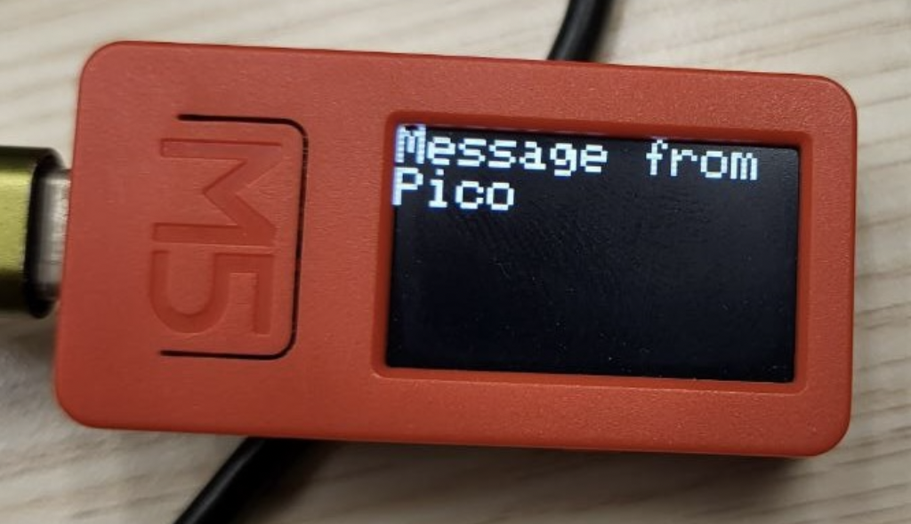
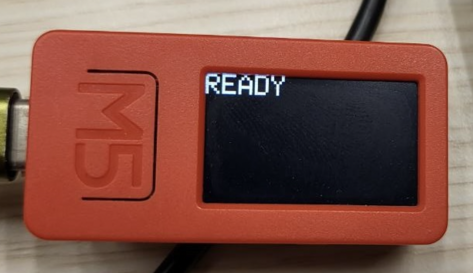

Below are the screenshots for the bluetooth terminal receiving the message.
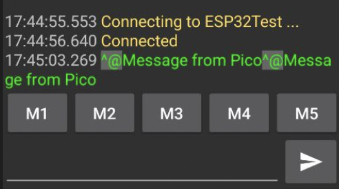