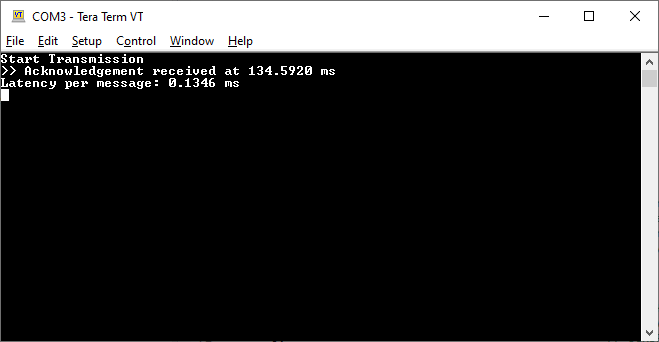
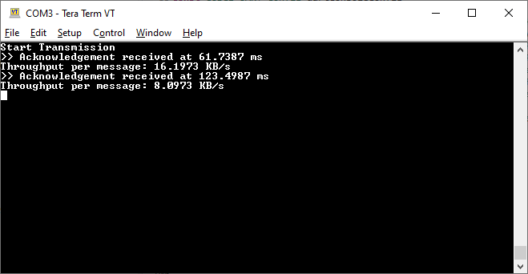

# CSC2003 Team A2 Communications Module

## UART Performance
|Latency          |Throughput |
|-----------------|-----------|
|0.1346 ms/message|8.0973 KB/s|

### Test Parameters:
Latency Test: 1000 characters sent sequentially

Throughput Test: 1KB message sent

### Result Images:

<u>Latency Test</u>

<u>Throughput Test</u>

